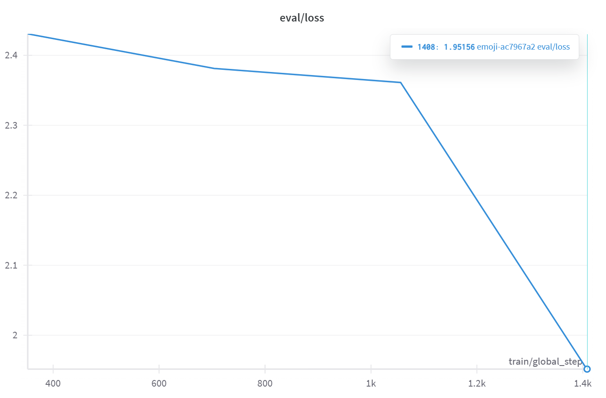

# Twitter Emoji Reaction LoRA

Twitter Emoji Reaction LoRA is a Python project for fine-tuning a RoBERTa-based transformer model on the TweetEval emoji prediction task using Low-Rank Adaptation (LoRA). It provides command line utilities for training, evaluation and inference, along with Jupyter notebooks for exploration.

## Features

- **LoRA Training** – fine-tune `roberta-base` with LoRA adapters on the 20-class TweetEval emoji dataset.
- **Hugging Face Integration** – scripts can push the resulting model to the Hugging Face Hub.
- **Logging & Experiment Tracking** – accuracy, macro‑F1 and top‑3 accuracy via `compute_metrics`. Tracked using Weights & Biases.
- **Inference Pipeline** – predict the most likely emojis for new text from the command line.
- **Gradio App** - ready for deployment and hosted on [Huggingface Spaces](https://huggingface.co/spaces/codinglabsong/twitter-emoji-reaction-coach-lora)
- **Reproduciblility** - simple, reproducible training workflows with flexible configurations.
- **Data Preprocessing** - tokenization and relabeling
- **Developer Tools** - tests and developer tools such as ruff and black

## Installation

1. Clone this repository and install the core dependencies:

```bash
pip install -r requirements.txt
```

2. (Optional) Install development tools for linting and testing:

```bash
pip install -r requirements-dev.txt
pre-commit install
```

3. Install the package itself (runs `setup.py`):
```bash
# Standard install:
pip install .

# Or editable/development install:
pip install -e .
```

4. Provide the required environment variables for Hugging Face and Weights & Biases. You can create a `.env` file from the supplied example:

```bash
cp .env.example .env
# then edit HUGGINGFACE_TOKEN and WANDB_API_KEY
```

## Data

The project uses the [TweetEval](https://huggingface.co/datasets/tweet_eval) *emoji* subset. Run the helper script to download and cache the dataset locally:

```bash
bash data/download.sh
```

## Training

Use the wrapper script to launch training with your preferred hyper‑parameters:

```bash
bash scripts/run_train.sh --num_train_epochs 4 --learning_rate 5e-4
```

Additional options are documented via:

```bash
python -m twitter_emoji_reaction_lora.train --help
```

Models are saved under the directory specified by `--model_id` and can optionally be pushed to the Hugging Face Hub when `--push_to_hub` is set.

## Inference

After training (or for a published adapter), you can evaluate on the test split or predict emojis for custom text:

```bash
bash scripts/run_inference.sh --mode test --model_id roberta-base-with-tweet-eval-emoji
```

To predict emojis for your own sentences:

```bash
bash scripts/run_inference.sh --mode predict --texts "Happy birthday!" "I love this" --top_k 3
```

## Results



Note: Val loss is logged per epoch. The last logged value is from the test set.

| Metric | Value |
| ------ | ----- |
| Accuracy | *0.4252* |
| F1 macro | *0.3314* |
| Top‑3 accuracy | *0.6504* |
| Loss | *1.9516* |

These results on the test set should be comparable to community benchmarks (see the [TweetEval leaderboard](https://github.com/cardiffnlp/tweeteval)).

You can access this checkpoint model on [Hugging Face Hub](https://huggingface.co/codinglabsong/roberta-base-with-tweet-eval-emoji).

## Running the Gradio Inference App
This project includes an interactive Gradio app for making predictions with the trained model.

1. **Obtain the Trained Model:**
- Make sure you have the trained model directory (`roberta-base-with-tweet-eval-emoji/`). 
- If you trained the model yourself, it should be saved automatically in the project root.
- Otherwise, you can download it from [Releases](https://github.com/codinglabsong/twitter-emoji-reaction-coach-lora/releases/tag/v1.0.0) and add it in the project root.

2. **Run the App Locally:**
```bash
python app.py
```
- The app will start locally and print a link (e.g., `http://127.0.0.1:7860`) to access the web UI in your browser.

> You can also access the hosted demo on [Huggingface Spaces](https://huggingface.co/spaces/codinglabsong/twitter-emoji-reaction-coach-lora)

## Testing

Run the unit tests with `pytest`:

```bash
pytest
```

## Repository Structure

- `src/twitter_emoji_reaction_lora/` – implementation modules (`train.py`, `inference.py`, etc.)
- `scripts/` – convenience shell scripts for training and inference
- `data/` – dataset notes and download helper
- `notebooks/` – example notebooks for exploration and evaluation
- `tests/` – minimal unit tests

## Requirements

- See `requirements.txt`
- Python >= 3.10
- PyTorch >= 2.6

## Contributing

Open to issues and pull requests!

## Acknowledgements
- [FacebookAI/roberta-base][(](https://huggingface.co/FacebookAI/roberta-base))
- [Huggingface LoRA Docs](https://huggingface.co/docs/peft/main/en/conceptual_guides/lora)

## License

This project is licensed under the [MIT License](LICENSE).